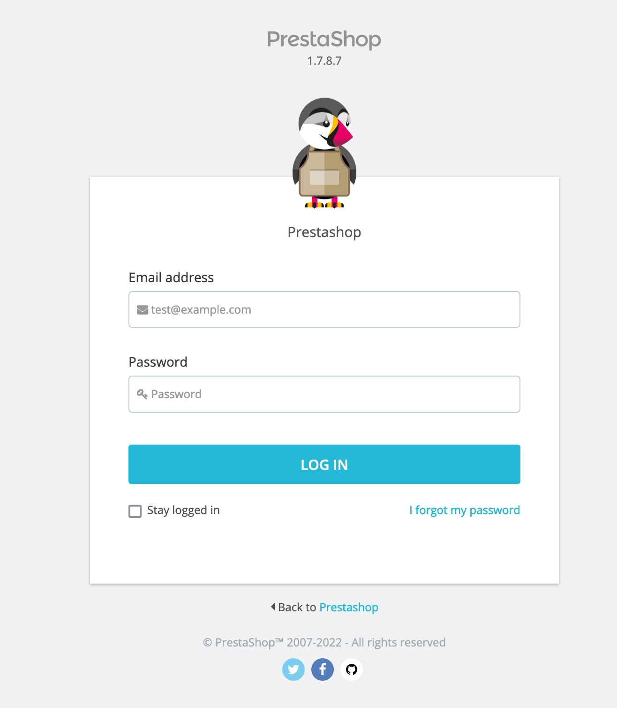
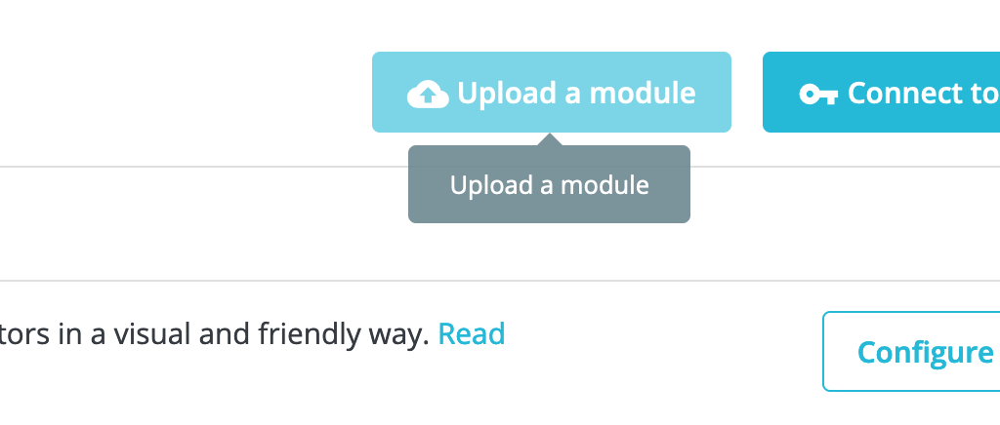
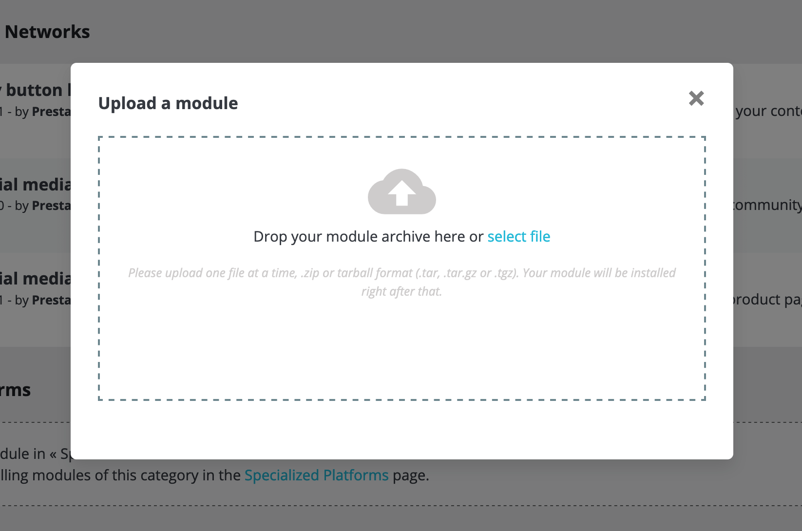
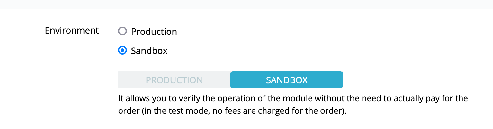
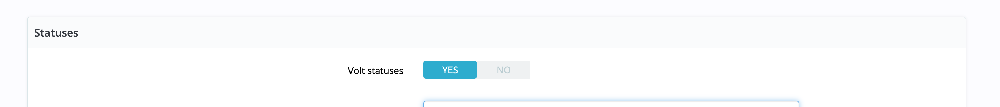
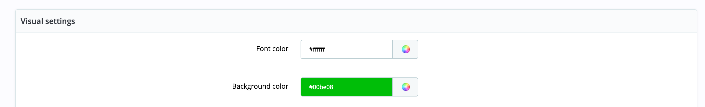
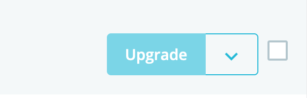
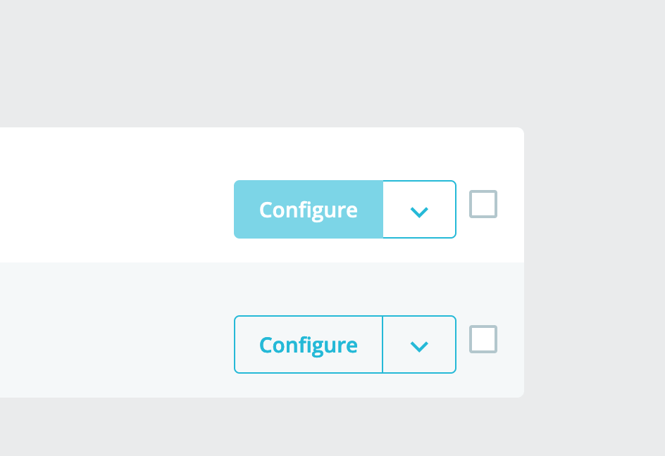

# Volt Payment module instructions

### Main functions
- Payment module

### Requirements
- PrestaShop minimum version: 1.7.6
- Minimum version of PHP 7.2

## Addons installation
Follow the instructions below:

1. Log into your admin panel in PrestaShop.
2. Click Modules > Catalogue and type "Pay by Bank" into the search engine.
3. Once you have found the payment module, click Install

## Installation of the plug-in from the zip package

3) After logging in, go to Modules > Modules and Services (or Module Manager - depending on your shop version).
- Click Add new module (visible in the top right corner) to upload the file package you downloaded in the previous step;

- click **Upload a module** and upload module

Once the installation is complete, the system will automatically take you to Module Configuration.

## Configuration

### Authorization
The main data needed to launch the payment. Remember to switch sandbox mode to production mode

### States
Set transaction statuses as you need them

### Theme widget
Customize the appearance of the widget to suit your needs

## Update
To update-click Upgrade.

## Uninstall
To uninstall the module - select **Uninstall**.

